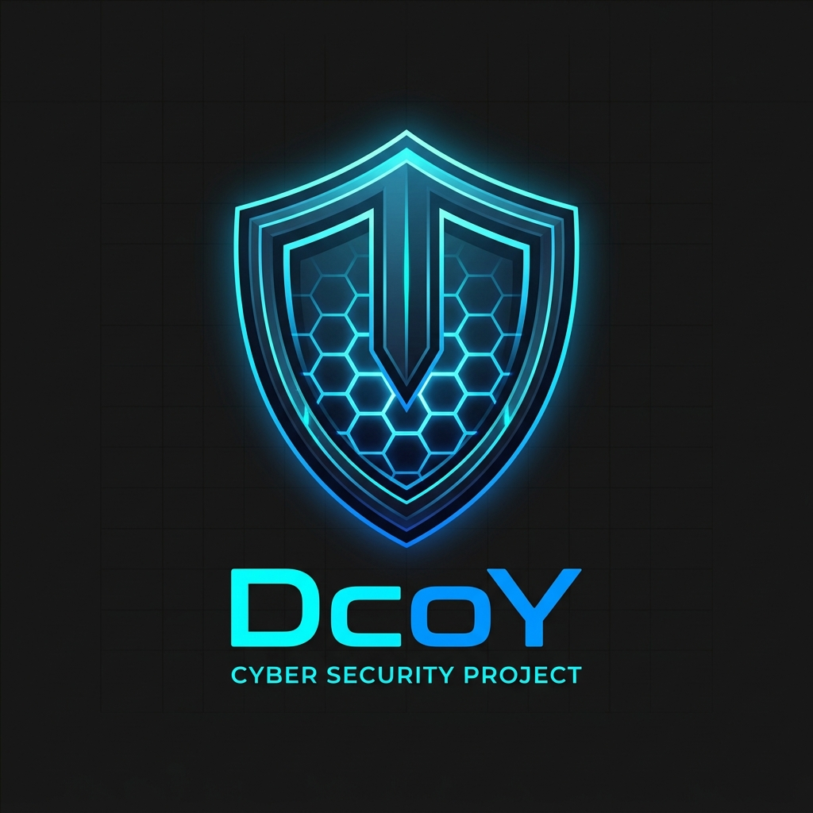

# <p align="center"><br/>DcoY</p>

<p align="center">
  <strong>Intelligent Real-Time Threat Detection & Autonomous Deception response</strong>
</p>

<p align="center">
  <a href="https://github.com/AKJenaX/DcoY/releases"></a>
  <a href="LICENSE"></a>
  <a href="https://www.python.org/"></a>
  <a href="https://github.com/AKJenaX/DcoY/actions/workflows/ci.yml"></a>
  <a href="https://github.com/AKJenaX/DcoY"></a>
</p>

---

## 🛡️ Overview

**DcoY** is a modern, real-time cyber threat detection and active defense deception platform. It uses machine learning (**Isolation Forest**) to score and flag anomalous network telemetry, deploys virtual honeypots dynamically to isolate attackers, and integrates a fail-fast local LLM reasoning agent (**Ollama/Llama 3**) using a built-in **circuit breaker** to explain security decisions to operators in real-time.

---

## 📊 Features

* 🌲 **ML Anomaly Detection**: isolation Forest model scoring network pattern anomalies dynamically.
* 🕸️ **Active Deception Engine**: Dynamic honeypot allocation (SSH, Web traps) mapped to attacker profiles.
* 🤖 **Fail-Fast LLM Explanations**: Local LLM reasoning using Ollama with a **150ms connection probe** and an in-memory **circuit breaker** to prevent timeouts when the LLM is offline.
* 💬 **AI Copilot**: Streamlit conversational interface for dialogue Q&A with security logs.
* 📄 **PDF Reporting**: Instantly compiles and exports detailed security telemetry summaries.
* 🧪 **Telemetry Simulator**: Synthetic threat stream simulator to test ingestion pipelines live.

---

## 📸 Screenshots

*(Dashboard visualizations)*

| Overview Dashboard | Live Geolocation Map | Copilot Q&A Box |
| :---: | :---: | :---: |
| `assets/screenshots/dashboard_kpi.png` | `assets/screenshots/attack_map.png` | `assets/screenshots/chat_copilot.png` |

---

## 🗺️ Subsystem Architecture

```
                               ┌───────────────────┐
                               │   Event Ingest    │
                               │  (simulator.py)   │
                               └─────────┬─────────┘
                                         │ POST
                                         ▼
┌─────────────────────────────────────────────────────────────────────────────────┐
│ FastAPI Backend Service                                                         │
│                                                                                 │
│      ┌───────────────┐        ┌───────────────┐         ┌────────────────┐      │
│      │  Health Check │        │  Live Store   ├────────►│ ML Detection   │      │
│      │   Endpoint    │        │  (In-Memory)  │         │(Isolation Forest)     │
│      └───────────────┘        └───────┬───────┘         └────────┬───────┘      │
│                                       │                          │              │
│                                       ▼                          ▼              │
│ ┌──────────────────────┐      ┌───────────────┐         ┌────────────────┐      │
│ │   Circuit Breaker    │      │  PDF Builder  │         │ Deception Agent│      │
│ │ (Ollama Explanations)◄──────┤  (ReportLab)  │         │ (Honeypot Trap)│      │
│ └──────────────────────┘      └───────────────┘         └────────────────┘      │
└───────────────────────────────────────┬─────────────────────────────────────────┘
                                        │
                                        ▼ Web Sockets / REST
┌─────────────────────────────────────────────────────────────────────────────────┐
│ Streamlit Frontend Dashboard                                                    │
│                                                                                 │
│      ┌─────────────────┐       ┌─────────────────┐       ┌─────────────────┐    │
│      │   Sidebar KPI   │       │   Plotly Map    │       │ Copilot Chatbox │    │
│      └─────────────────┘       └─────────────────┘       └─────────────────┘    │
└─────────────────────────────────────────────────────────────────────────────────┘
```

---

## 🛠️ Tech Stack

* **Backend Framework**: FastAPI, Pydantic V2, Uvicorn
* **Data Processing & ML**: Scikit-Learn, Pandas, NumPy
* **Frontend Visualization**: Streamlit, Plotly, Streamlit Autorefresh
* **Security & Token Auth**: Python-Jose (JWT), Passlib (Bcrypt)
* **Local LLM Orchestration**: Ollama (Llama 3)
* **Document Compilation**: Reportlab (PDF generation)

---

## 🚀 Quick Start

### 1. Clone & Configure Environments
```bash
git clone https://github.com/AKJenaX/DcoY.git
cd DcoY
cp .env.example .env
```

### 2. Startup FastAPI Backend
```bash
cd backend
python -m venv .venv
source .venv/bin/activate  # Windows: .\.venv\Scripts\Activate.ps1
pip install -r requirements.txt
python -m uvicorn app.main:app --reload
```
Interactive API docs are available at `http://127.0.0.1:8000/docs`.

### 3. Startup Streamlit Frontend
In a new terminal window:
```bash
cd dashboard
pip install -r requirements.txt
python -m streamlit run app.py
```
The dashboard opens automatically at `http://localhost:8501`.

### 4. Run Traffic Simulator
In a separate terminal window:
```bash
python simulator.py
```

---

## 🐳 Docker Container Deployment

DcoY comes with built-in Docker support to run the backend and dashboard containers together.

### Run via Docker Compose
To build and spin up the complete sandbox environment:
```bash
docker-compose up --build
```
This launches:
* **Backend API** on `http://localhost:8000`
* **Streamlit Dashboard** on `http://localhost:8501`

---

## ⚙️ Configuration Variables

<details>
<summary>💡 Click to expand environment variables details (.env)</summary>

| Variable | Description | Default |
| :--- | :--- | :--- |
| `APP_NAME` | Display name of the platform | `DcoY` |
| `DEBUG` | Enables hot-reload and disables strict secret key checking | `True` |
| `SECRET_KEY` | JWT secret signature token (Must be >32 characters in production) | (Auto-generated in DEV) |
| `LLM_ENABLED` | Toggle local Ollama integrations | `True` |
| `LLM_HOST` | Host address connecting to Ollama | `http://127.0.0.1:11434` |
| `LLM_MODEL` | Default Ollama model name | `llama3` |
| `LLM_TIMEOUT` | Max network connection wait limit for Ollama response | `2.0` |

</details>

---

## 📂 Project Directory Structure

```
DcoY/
  ├── .github/               # Issue templates, PR templates, and CI/CD workflows
  ├── assets/                # Branding assets, diagrams, and app screenshots
  ├── backend/               # FastAPI backend source packages & unit tests
  ├── dashboard/             # Streamlit visual dashboard source files
  ├── docs/                  # Detailed design specifications and setup tutorials
  ├── scripts/               # Developer diagnostics and test utility files
  ├── docker-compose.yml     # Docker Compose orchestration file
  ├── simulator.py           # Real-time traffic events simulator
  └── requirements-dev.txt   # Development dependencies list
```

---

## 📖 Documentation Directory
For deep architectural details and security guidelines, refer to the documents in the `docs/` folder:
* **[quick-start.md](docs/quick-start.md)**: Detailed step-by-step sandbox setup guide.
* **[test-commands.md](docs/test-commands.md)**: List of diagnostic CLI curl test commands.
* **[real-time-setup.md](docs/real-time-setup.md)**: Details on the real-time event pipeline structure.
* **[architecture.md](docs/architecture.md)**: Backend component relationships.
* **[system-design.md](docs/system-design.md)**: ML modeling and active honeypot allocation rules.
* **[security.md](docs/security.md)**: Cryptographic guidelines and auth configurations.
* **[development.md](docs/development.md)**: Development patterns and debugging logs.

---

## 🛣️ Roadmap
* **v0.1.0-alpha** *(Current)*: In-memory live threat telemetry caching and dashboard visualizations.
* **v0.2.0-beta**: Add SQLite storage for chat dialogs and event log persistence.
* **v0.3.0-stable**: Real-time packet parsing interfaces (PCAP capture analysis).

---

## 🤝 Contributing & Support
Contributions are always welcome! Read **[CONTRIBUTING.md](CONTRIBUTING.md)** for standard conventions.
Found a bug? Report it privately following our **[SECURITY.md](SECURITY.md)** guidelines.

---

## 📄 License
This project is licensed under the terms of the **[MIT License](LICENSE)**.
