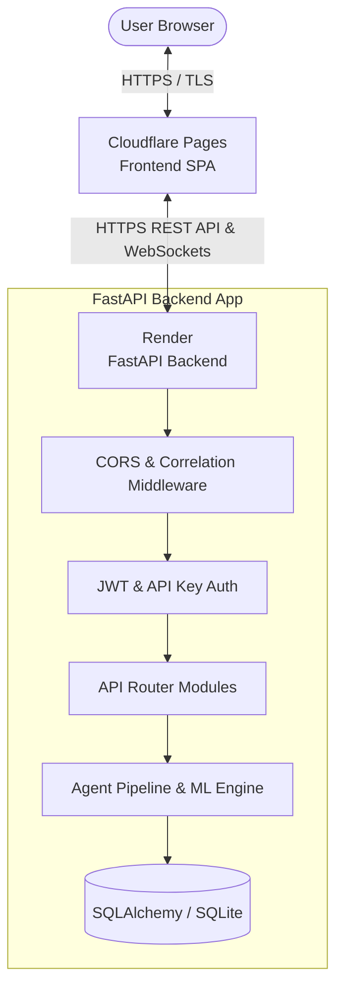

<h1 align="center">DcoY</h1>

<p align="center">
  <a href="https://github.com/AKJenaX/DcoY/releases"></a>
  <a href="LICENSE"></a>
  <a href="https://www.python.org/"></a>
  <a href="https://fastapi.tiangolo.com/"></a>
  <a href="https://www.docker.com/"></a>
  <a href="https://render.com/"></a>
  <a href="https://pages.cloudflare.com/"></a>
</p>

DcoY is an open-source active defense and threat deception console designed for real-time security telemetry analysis, anomaly detection, automated honeypot misdirection, and incident investigation.

---

## Overview

### What DcoY Is
DcoY is a web-based Security Operations Console (SOC) that combines machine learning anomaly detection, deception honeypots, and incident investigation tools into a unified interface.

### What Problem It Solves
Traditional security monitoring relies heavily on passive log collection and static threshold alerts, which often results in alert fatigue and delayed incident response. DcoY actively intercepts incoming telemetry, calculates continuous anomaly scores, routes suspicious traffic to virtual honeypot listeners, and structures forensic evidence into trackable cases.

### Intended Users
- **Security Analysts & SOC Operators**: For triaging live telemetry, analyzing attack graphs, and managing investigation cases.
- **Detection Engineers**: For creating, testing, and benchmarking custom detection rules.
- **Security Researchers & Engineers**: For studying threat deception mechanics and automated incident response workflows.

### High-Level Architecture
DcoY is structured as a decoupled web application comprising a React Single Page Application (SPA) hosted on Cloudflare Pages and a Python FastAPI backend deployed on Render. Communication occurs over HTTPS REST endpoints and WebSockets for real-time telemetry streaming.

---

## Features

### Threat Detection
- **Isolation Forest Anomaly Scoring**: Evaluates incoming network metrics (failed logins, port attempts, request rates) against unsupervised ML models.
- **Rule Engine**: Evaluates telemetry against custom rules with configurable thresholds, severity levels, and MITRE ATT&CK technique tags.

### Deception Engineering
- **Active Honeypot Orchestration**: Dynamically maps high-risk IP addresses to synthetic honeypot listeners (SSH, HTTP, Database traps).
- **Deception Metrics**: Tracks decoy engagement states, response actions, and isolation strategies.

### Investigation & Case Management
- **Database-Backed Case Ledger**: Supports case creation, priority tagging, status tracking, evidence association, and timeline history.
- **Forensic Evidence Linking**: Associates raw telemetry events with active investigation records.

### Knowledge Graph & Topology
- **Attack Path Topology (Hive Map)**: Renders network nodes, honeypots, and compromise vectors.
- **Graph Routing**: Calculates compromise propagation paths using Dijkstra shortest-path algorithms.

### Reporting & Executive Intelligence
- **Operational Metrics**: Aggregates SOC key metrics including open investigations, platform health scores, and critical alert rates.
- **Multi-Format Export**: Generates incident and executive reports in PDF, Markdown, and JSON formats.

### Observability & Resilience
- **Request Correlation**: Assigns a unique `X-Request-ID` UUID header to every HTTP request for end-to-end tracing.
- **Health Probes**: Exposes `/health/live` and `/health/ready` endpoints for automated liveness and readiness checks.
- **Metrics Endpoint**: Exposes Prometheus-compatible application metrics at `/metrics`.

### Authentication & Access Control
- **Persistent Auth**: Password hashing using `bcrypt` and SHA-256 hashed API key persistence.
- **JWT Sessions**: Token-based authentication (`Bearer` JWT) for protected API routes and WebSocket connections.

---

## Live Demo

| Service | Environment | URL |
| :--- | :--- | :--- |
| **Frontend App** | Cloudflare Pages | [https://dcoy.pages.dev](https://dcoy.pages.dev) |
| **Backend API** | Render | [https://dcoy-9n8n.onrender.com](https://dcoy-9n8n.onrender.com) |
| **Swagger UI** | Render | [https://dcoy-9n8n.onrender.com/docs](https://dcoy-9n8n.onrender.com/docs) |
| **ReDoc** | Render | [https://dcoy-9n8n.onrender.com/redoc](https://dcoy-9n8n.onrender.com/redoc) |
| **Health Endpoint** | Render | [https://dcoy-9n8n.onrender.com/health](https://dcoy-9n8n.onrender.com/health) |

*Default Credentials:* `operator` / `secure_password`

---

## Architecture



### Component Breakdown
1. **Cloudflare Pages**: Serves the static compiled React SPA assets over Cloudflare's global edge CDN.
2. **FastAPI (Render)**: Runs the Python backend service, handling HTTP REST requests, authentication, ML detection execution, and WebSocket telemetry connections.
3. **SQLite Database**: Manages persistent records for users, API keys, detection rules, and investigation cases.
4. **WebSocket Router**: Streams live telemetry broadcasts directly to connected browser clients.

---

## Technology Stack

| Layer | Technology |
| :--- | :--- |
| **Frontend** | React 18, TypeScript 5, Vite, Tailwind CSS, Lucide Icons |
| **Backend** | Python 3.11, FastAPI, Uvicorn, Starlette |
| **Database** | SQLite, SQLAlchemy ORM, Alembic |
| **Authentication** | PyJWT, bcrypt, SHA-256 API Keys, HMAC |
| **Deployment** | Cloudflare Pages (Frontend), Render (Backend) |
| **Containerization** | Docker, Docker Compose, Multi-stage Nginx |
| **AI / Machine Learning** | Scikit-learn (Isolation Forest), Pandas, NumPy |
| **Documentation** | OpenAPI 3.0, Swagger UI, ReDoc |
| **Testing** | Pytest (101 backend unit & integration tests) |

---

## Project Structure

```text
DcoY/
├── backend/
│   ├── alembic/                # Database migrations
│   ├── app/
│   │   ├── agents/             # Detection, deception, and response agent logic
│   │   ├── dependencies/       # Authentication and permission dependencies
│   │   ├── middleware/         # Request correlation, CORS, and logging middleware
│   │   ├── models/             # Pydantic V2 schemas & SQLAlchemy ORM models
│   │   ├── repositories/       # Database access layer
│   │   ├── routers/            # API router modules (auth, detect, cases, etc.)
│   │   ├── services/           # Rule engine and graph calculation services
│   │   └── main.py             # FastAPI entrypoint and lifespan manager
│   └── tests/                  # Pytest backend test suite (101 tests)
├── frontend/
│   ├── src/
│   │   ├── components/         # Reusable React UI primitives
│   │   ├── hooks/              # Real-time WebSocket and state hooks
│   │   ├── services/           # REST API client
│   │   └── views/              # SOC Console page views
│   ├── Dockerfile              # Production Nginx multi-stage build
│   └── nginx.conf              # Nginx reverse proxy configuration
├── design-system/              # Shared CSS design tokens and theme primitives
├── docs/                       # Technical documentation guides
├── scripts/                    # Verification diagnostic scripts
└── docker-compose.yml          # Multi-container orchestration config
```

---

## Local Development

### 1. Clone Repository
```bash
git clone https://github.com/AKJenaX/DcoY.git
cd DcoY
```

### 2. Setup & Run Backend
```bash
cd backend
python -m venv .venv
# Activate environment:
# Windows: .\.venv\Scripts\Activate.ps1
# Linux/macOS: source .venv/bin/activate

pip install -r requirements.txt
python -m uvicorn app.main:app --host 127.0.0.1 --port 8001 --reload
```

### 3. Setup & Run Frontend
```bash
# In a new terminal
cd frontend
npm install
npm run dev
```

Open [http://localhost:5173](http://localhost:5173) in your browser.

---

## Docker Deployment

Build and run the full stack locally using Docker Compose:

```bash
# Copy example environment configuration
cp production.env.example .env

# Build and start containers
docker-compose up --build -d
```

The frontend container will be accessible at `http://localhost:80` and backend at `http://localhost:8001`.

To stop containers:
```bash
docker-compose down
```

---

## API Documentation

The FastAPI backend automatically generates interactive OpenAPI documentation:

- **Swagger UI**: [https://dcoy-9n8n.onrender.com/docs](https://dcoy-9n8n.onrender.com/docs)
- **ReDoc**: [https://dcoy-9n8n.onrender.com/redoc](https://dcoy-9n8n.onrender.com/redoc)
- **OpenAPI Schema**: [https://dcoy-9n8n.onrender.com/openapi.json](https://dcoy-9n8n.onrender.com/openapi.json)
- **Health Checks**:
  - Liveness: `GET /health/live`
  - Readiness: `GET /health/ready`

---

## Deployment

### Frontend (Cloudflare Pages)
- Hosted on Cloudflare Pages edge network.
- Automated deployment on push to `main` branch.
- Communicates with Render backend over HTTPS REST calls and WSS WebSockets.

### Backend (Render)
- Deployed as a Docker Web Service on Render.
- Listens for requests on port `8001` (or `$PORT` assigned by environment).
- Implements CORS middleware configured to accept `https://dcoy.pages.dev` and local development origins.

### Data Storage
- SQLite database instance configured via `DATABASE_URL`.
- Parent directories automatically verified and created on startup.

---

## Screenshots

> *Placeholder: Landing Page*  
> Description: Public landing overview displaying core platform capabilities.

> *Placeholder: Login Portal*  
> Description: Authenticated login portal accepting username and password credentials.

> *Placeholder: SOC Command Center Dashboard*  
> Description: Real-time threat telemetry feed, alert metrics, and MITRE ATT&CK heatmap.

> *Placeholder: Knowledge Graph (Hive Map)*  
> Description: Interactive network topology graph showing attack nodes and honeypot traps.

> *Placeholder: Investigation Case Ledger*  
> Description: Database-backed case workspace displaying timelines and evidence logs.

> *Placeholder: Reports & Executive Intelligence*  
> Description: Executive intelligence KPIs and PDF export controls.

---

## Security

- **JWT Session Tokens**: Encrypted JWT access tokens passed via standard `Authorization: Bearer <token>` headers.
- **Cryptographic Password Hashing**: Passwords stored using native `bcrypt` hashing.
- **SHA-256 API Key Storage**: API keys hashed before persistence and verified using `hmac.compare_digest` constant-time comparison to prevent timing attacks.
- **CORS Policies**: Explicit origin validation restricting API access to authorized domain origins.
- **Structured Exception Logging**: Error handlers mask internal stack traces while writing structured logs with correlation IDs.

---

## Testing

The backend includes a test suite covering routers, authentication, ML detection, and observability.

Run tests using pytest:

```bash
cd backend
python -m pytest
```

Output summary:
```text
================ 101 passed in 40.24s ================
```

To run with coverage reporting:
```bash
python -m pytest --cov=app --cov-report=term-missing
```

---

## Roadmap

### Completed
- [x] FastApi modular router refactoring and lifespan lifecycle management.
- [x] Persistent SQLite authentication (Users and API keys).
- [x] Structured JSON logging and request correlation ID middleware.
- [x] Multi-stage production Docker containerization for frontend Nginx and backend.
- [x] Deployment to Cloudflare Pages (Frontend) and Render (Backend).

### In Progress
- [ ] Redis Pub/Sub integration for horizontal WebSocket scaling across multiple worker processes.
- [ ] PostgreSQL migration scripts and connection pooling verification.

### Future Work
- [ ] eBPF socket monitoring agent for Linux kernel event collection.
- [ ] Automated Syslog / CEF exporter for SIEM integration.

---

## Contributing

1. Fork the repository.
2. Create a feature branch (`git checkout -b feature/amazing-feature`).
3. Commit your changes (`git commit -m 'feat: add amazing feature'`).
4. Push to the branch (`git push origin feature/amazing-feature`).
5. Open a Pull Request.

Please ensure all tests pass (`python -m pytest`) before submitting a PR.

---

## License

Distributed under the MIT License. See [`LICENSE`](LICENSE) for more information.
