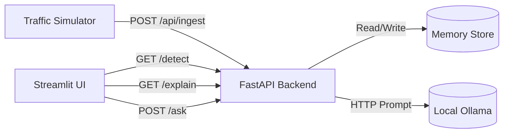
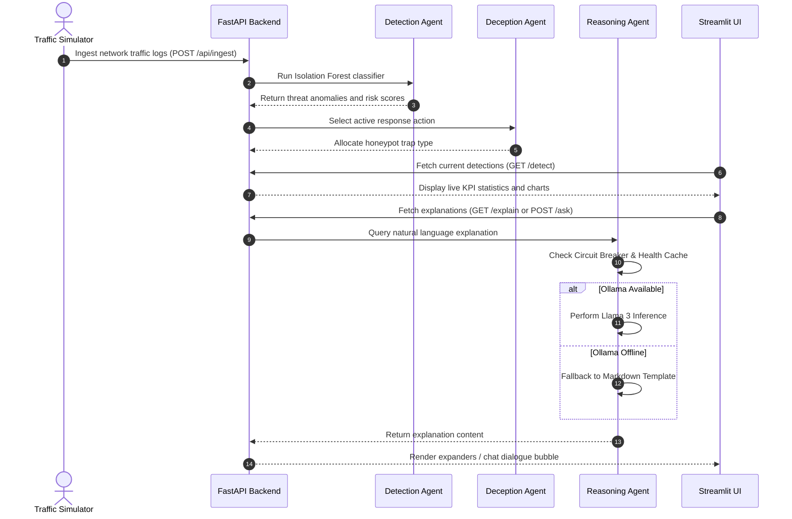
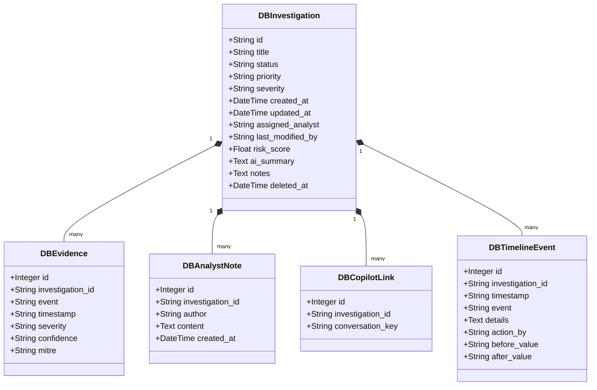

# DcoY Subsystem Architecture

This document describes the high-level subsystem interactions and data flow pipelines within the DcoY platform.

---

## 🏛️ System Block Diagram

---

## 🔄 Sequence Pipeline Flow

The diagram below details the end-to-end telemetry ingestion, detection classification, agent mitigation, and UI rendering pipeline:

---

## 💾 3. Database Schema Design (SQLAlchemy)

DcoY implements persistent storage using an SQLite backend for security cases, evidence mapping, analyst logs, and AI dialog links:

---

## 🏛️ 4. Repository & Adapter Pattern

- **InvestigationRepository**: Decouples SQLAlchemy session execution from FastAPI path operators, handling soft deletes, N+1 query mitigations (`joinedload`), and immutable audit trail generation.
- **Notification Engine**: Uses an adapter interface allowing events (such as critical case creation or assignment changes) to be broadcasted to Slack, Teams, PagerDuty, and Email alert networks.

---

## ⏳ 5. Investigation Lifecycle Management

Cases transition through three states:
1. **Open**: Case is newly initialized from telemetry outliers.
2. **Active**: Assigned to a security analyst for triage, evidence aggregation, and playbook execution.
3. **Resolved**: Mitigations applied (e.g., firewall isolation) and audit trail logged.

