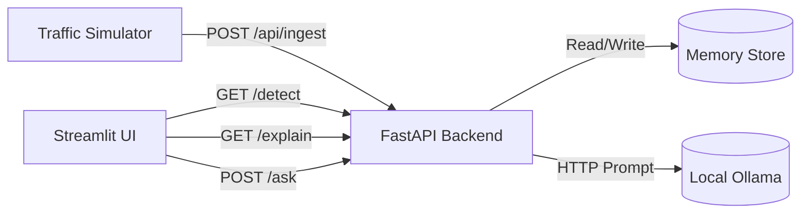
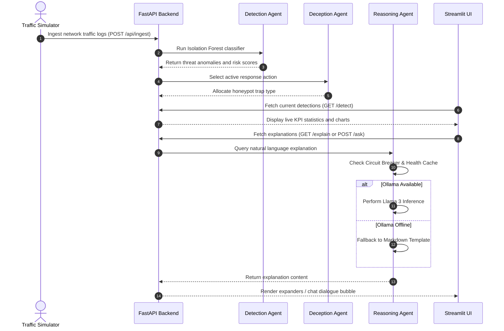

# DcoY Subsystem Architecture

This document describes the high-level subsystem interactions and data flow pipelines within the DcoY platform.

---

## 🏛️ System Block Diagram

---

## 🔄 Sequence Pipeline Flow

The diagram below details the end-to-end telemetry ingestion, detection classification, agent mitigation, and UI rendering pipeline:

